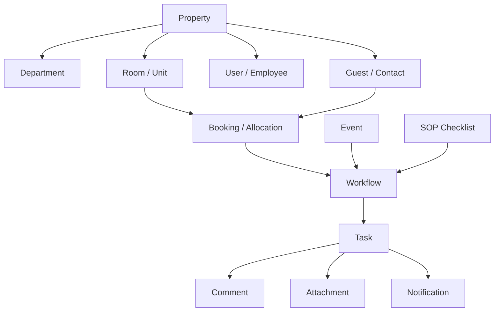

# AI_CONTEXT.md — Canonical System & Product Constitution

This document is the single source of truth for **HospitalityOS (Daily Operations Hub)**. It merges, refines, and synthesizes the product vision, system architecture, database models, background workflows, V1 specifications, and the development constitution.

---

## 1. 🎯 Executive Vision & Product Philosophy

HospitalityOS is an **AI-powered operational intelligence layer** that acts as the operational brain of a property. Rather than replacing existing transaction-focused software (PMS, POS, accounting systems), it sits above them to coordinate daily execution.

### The Moat: Operational Intelligence Network
Our competitive advantage is not simple workflow automation—it is the **compounding memory and intelligence network** that learns from every operational event across properties.
* **Operational Knowledge Graph:** AI understands the contextual relationships between Guests, Bookings, Rooms, Staff Availability, Asset Histories, and Inventory Levels.
* **Network Effects:** As scale grows, anonymized metadata provides cross-property benchmarking (e.g., *"Resorts of your size in coastal climates reduce housekeeping delays by 14% using this shift pattern"*).
* **Vertical Decoupling:** Decoupled Event $\rightarrow$ Workflow $\rightarrow$ Task architecture is industry-independent. Hospitality is the launch pad, but the core engine can translate directly to healthcare (beds/patients/nurses) or student housing.

---

## 2. 🕸️ Decoupled Domain Model (Entities & Relations)

All operations are modeled as generic relational nodes to ensure flexibility and scale.



### Core Entities
1. **Property:** Represents a physical hotel, resort, or service unit.
2. **Department:** Operational teams (Reception, Housekeeping, Kitchen, Maintenance, Security, Procurement).
3. **User:** Staff members assigned to roles (Owner, Manager, Supervisor, Receptionist, Housekeeper, Chef, Technician, Driver, Staff) with specific RBAC rules.
4. **Guest:** Customers with preferences, contact info, and loyalty states.
5. **Room:** Accommodation units with statuses (Available, Occupied, Dirty, Maintenance).
6. **Booking:** Guest reservations. Triggers check-in/out prep events.
7. **Event:** Standardized log of occurrences (Guest WhatsApp request, PMS booking, inventory drop, asset failure).
8. **Workflow:** Orchestrator node tracking sibling tasks mapped to a single source event.
9. **Task:** The core execution block (Title, Description, Assignee, Priority, SLA deadline, Status: PENDING, IN_PROGRESS, COMPLETED, CANCELLED, ESCALATED).
10. **Notification:** Logs communications sent via In-App, Push, Email, WhatsApp, or SMS.
11. **SOP & SOPTaskTemplate:** Definitions for recurring checklists triggered on schedules.
12. **Asset:** Physical equipment (HVAC, Generators) monitoring maintenance lifecycle.
13. **InventoryItem:** Consumables tracking quantity, unit, and minimum thresholds.
14. **AuditLog:** Permanent, append-only security trace of system actions.
15. **AIRecommendation:** Optimization insights generated by prediction modules.

---

## 3. ⚙️ Event-Driven System Architecture

The architecture is built on an asynchronous, event-driven pattern using a Next.js App Router API backend and serverless event queues.

```
External Triggers (WhatsApp, PMS, Webhooks)
         │
         ▼
[Integration API Gateway] ──(Persist raw Event)──► [Database]
         │
         ▼
[Inngest Event Router] ──(Asynchronous Workers)
         │
         ├──► handleGuestRequest (Runs AI NLU extraction)
         ├──► handleBookingCreated (Spawns prep checklists)
         ├──► handleInventoryLow (Creates procurement tasks)
         ├──► handleMaintenanceDue (Triggers repair tasks)
         └──► checkSopCron (Evaluates daily schedules)
```

### Core System Layers
* **Integration Layer:** REST API endpoints that consume raw payloads (e.g. WhatsApp JSON, booking syncs) and write records to the `Event` table.
* **Event Engine:** Evaluates new database events and publishes standard Inngest events (e.g., `guest.request.created`).
* **Workflow Engine:** A background serverless worker stack hosted via Inngest. Spawns tasks, resolves dependencies, and manages state changes.
* **Escalation Engine:** Inngest sleeping steps track SLA due dates. If a task is not closed before the deadline, it updates the task to `ESCALATED`, registers an audit log, and notifies management.

---

## 4. 🧠 Multi-Agent AI Architecture

The AI layer functions as a contextual assistant. Decisions remain explainable, human-supervised, and auditable.

```
               [Raw Incoming Text + Context]
                             │
                             ▼
                 [Understanding AI Agent]
              (Vercel AI SDK + LLM Provider)
                             │
                             ▼
         [JSON Schema: Confidence, Reasoning, Tasks]
                             │
                             ▼
           [Routed to Workflow & Task Engines]
```

### Specialized Agents
1. **Understanding Agent (NLU):** Translates unstructured guest messages or manager requests into structured tasks (mappings to priority, department, description, and SLA due minutes).
2. **Decision Engine:** Determines dependencies, schedules check-in preps, and coordinates cross-department handoffs.
3. **Recommendation Engine:** Evaluates workload metrics (e.g. housekeeping backlogs) and suggests operational shifts (e.g., reallocating receptionists to clean rooms).
4. **Prediction Engine (Future):** Forecasts maintenance breakdowns and inventory dropouts based on occupancy.

---

## 5. 🔄 Universal Workflows & SLA Lifecycle

Every task is governed by a strict lifecycle to ensure accountability and service consistency:

```
[Operational Event]
        │
        ▼
[Create Workflow (status: PENDING)]
        │
        ▼
[Spawn Tasks & Assign Departments] ──► (Notify Target Staff)
        │
        ├──► [Staff Claims Task] ──► (Status: IN_PROGRESS)
        │            │
        │            ▼
        │    [Staff Completes Task] ──► (Status: COMPLETED)
        │
        └──► [SLA Due Time Passes] ──► (Status: ESCALATED) ──► (Alert Managers)
```

1. **Trigger:** Event ingested (WhatsApp, PMS reservation, inventory drop, maintenance cron).
2. **Analysis:** AI extracts specific requirements.
3. **Routing:** Task is written to the database assigned to a specific `Department` with a calculated `dueDate`.
4. **Alerting:** Notifications are dispatched to staff in the target department.
5. **Tracking:** Staff can "Claim" (shift to `IN_PROGRESS`) or "Complete" (shift to `COMPLETED`).
6. **Escalation:** If the task is not completed by `dueDate`, a background scheduler moves status to `ESCALATED`, logs the breach, and alerts managers.
7. **Resolution:** When all tasks linked to a workflow are completed, the parent `Workflow` status is set to `COMPLETED` and the completion timestamp is logged.

---

## 6. 🏢 Modules & Department Ownership

Operational capabilities are grouped into modular domains:

| Module | Core Features | Target Departments |
| :--- | :--- | :--- |
| **Guest Operations** | WhatsApp integrations, Guest profiles, preference graphs. | Reception, Housekeeping, Kitchen, Restaurant |
| **Task Engine** | Manual task creation, claims, completions, and priority routing. | All Departments |
| **SOP Engine** | Cron scheduler for recurring checklists and template tracking. | Reception, Housekeeping, Security |
| **Inventory** | Stock counting, low stock events, reorder alert parameters. | Procurement, Kitchen, Housekeeping |
| **Maintenance** | Scheduled asset services and reactive repair tickets. | Maintenance, Security |
| **Reservations** | Room readiness checks, checkout coordination, VIP alerts. | Reception, Housekeeping, Management |
| **AI Decisions** | Workload reassignment recommendations and explaining reasoning. | Management, Supervisors |

---

## 7. 🔍 V1 Product Specifications (Scope & Gaps)

The V1 Daily Operations Hub focuses on **operational coordination**, purposely excluding enterprise modules like billing, channel managers, or predictive maintenance.

### Target Capabilities
* Single property support (multi-property schemas configured but inactive).
* In-app notifications feed and audit timeline visualization.
* Basic inventory alerts and scheduled asset crons.
* Staff dashboard filters based on department settings.

### Identified Code Gaps
1. **Manual Task Creation (Missing):** Current task creation is entirely event-driven. The UI lacks a manual creation form and the backend lacks a POST endpoint (`/api/tasks`) to save manual tasks.
2. **Manager Control Panel (Missing):** The dashboard UI is unified. Managers cannot manually override task assignments, reassign staff to other departments, or configure custom SOP crons.
3. **Restaurant Department (Missing):** The Restaurant department is in the spec sheet but omitted in the DB seeds, AI routing categories, and UI filters.

---

## 8. 🛠️ Development Constitution

To prevent technical debt, all developers and AI agents must adhere to these coding, database, and API rules.

### TypeScript & React Guidelines
* **Type Safety:** Avoid `any` types. Specify exact Interfaces for tasks, logs, stats, and metadata. Use zod validation for API boundaries.
* **React Render Safety:** Never call state updates (`setState()`) synchronously within the body of a `useEffect` hook. Run fetches asynchronously or handle them through triggered events.
* **Lint Compliance:** Ensure `npm run lint` passes before staging code. Clean up unused imports, variables, and handle promise rejections.

### API Standards
* Endpoints must be RESTful, validate inputs using schemas, and return predictable status codes (e.g. `200 OK`, `400 Bad Request`, `500 Server Error`).
* Always log errors on the server and return user-friendly, secure messages to the client.

### Database Guidelines
* Maintain absolute referential integrity using Prisma relations.
* Never delete audit history or completed workflow records; soft-delete operational parameters if history must be retained.
* All schema changes require a schema update in [schema.prisma](file:///E:/ClimForge/Hotel%20management/prisma/schema.prisma) and must be verified locally.
