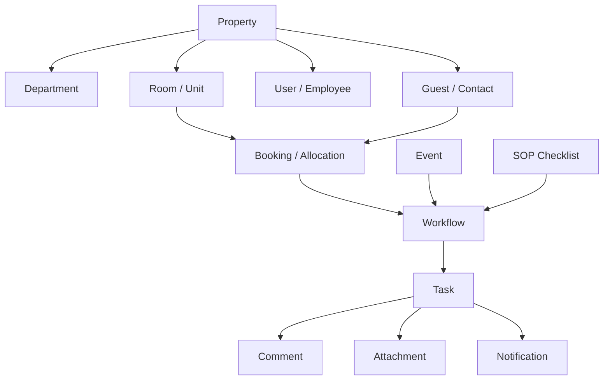

# 🏨 HospitalityOS: Master Project Context & Complete System Specification

> **Single Source of Truth for HospitalityOS**
> This document contains the complete context, product philosophy, technical architecture, database schema, API reference, feature capabilities, development status, and sales positioning for **HospitalityOS (Daily Operations Hub)**. It is specifically structured so that any developer or AI Language Model (LLM) can read this single file and gain 100% complete understanding of the system.

---

## 📋 Table of Contents
1. [Executive Vision & Product Philosophy](#1-executive-vision--product-philosophy)
2. [Master Technical Architecture & Stack](#2-master-technical-architecture--stack)
3. [Enterprise Multi-Tenant Row-Level Security (RLS)](#3-enterprise-multi-tenant-row-level-security-rls)
4. [Core Domain Model & Complete Prisma Schema](#4-core-domain-model--complete-prisma-schema)
5. [Complete REST API Specification](#5-complete-rest-api-specification)
6. [Background Workflows & Event Engine (Inngest)](#6-background-workflows--event-engine-inngest)
7. [Comprehensive Feature & Capabilities Guide](#7-comprehensive-feature--capabilities-guide)
8. [Development Status & Health Checkpoint](#8-development-status--health-checkpoint)
9. [Target Buyer Personas & Sales Pitch Narrative](#9-target-buyer-personas--sales-pitch-narrative)
10. [AI Coding Agent Guidelines & Operating Rules](#10-ai-coding-agent-guidelines--operating-rules)

---

## 1. 🎯 Executive Vision & Product Philosophy

HospitalityOS is an **AI-powered operational intelligence layer** designed to coordinate daily hotel and resort execution. It does **not** replace transaction-focused software like Property Management Systems (PMS), Point of Sale (POS), or accounting suites; rather, it sits above them to bridge departmental silos, automate work routing, and provide predictive intelligence.

```
       [ Siloed Legacy Stack ]       │            [ HospitalityOS ]
   PMS ──┐                           │
   POS ──┼─► [ Manual Checking ]     │   PMS/POS/IoT ──┐
   IoT ──┘                           │   WhatsApp ─────┼─► [ AI Event Brain ] ──► Auto-Routed Tasks
   SMS ──► [ Staff Group Texts ]     │   SMS/Sensors ──┘         │
                                     │                           ▼
                                     │                 Real-Time KPI & SLA Control
```

### The Strategic Moat: Operational Intelligence Network
1. **Operational Knowledge Graph:** The system models and links Guests, Rooms, Staff, Assets, and Inventory. AI utilizes this data graph to recommend smarter daily workflows.
2. **Multi-Tenant Network Effects:** Anonymized operational metadata provides cross-property benchmarking, helping properties optimize shift planning and reduce housekeeping/maintenance backlogs.
3. **Vertical Decoupling:** The decoupled event-to-workflow engine is industry-agnostic. While launching in hospitality, it easily adapts to healthcare (beds/patients/nurses), co-working hubs, or student housing.

> 💡 **Product Core Philosophy:** 
> Do not think in terms of static CRUD pages. Think in terms of **operational events**. Every action inside the property is an event, every event triggers a workflow, and every workflow coordinates one or more tasks executed by departments.

---

## 2. ⚡ Master Technical Architecture & Stack

### Technology Stack
* **Framework:** Next.js 16 (App Router with React 19 & TypeScript 5).
* **Styling:** Tailwind CSS v4 with custom **Midnight Obsidian & Electric Cyan/Violet** glassmorphism theme (`globals.css`).
* **Database & ORM:** Supabase PostgreSQL with Prisma ORM 5.22. Configured over an IPv4 Connection Pooler (`aws-1-ap-northeast-2.pooler.supabase.com:5432` with `?pgbouncer=true`).
* **Background Jobs & Event Bus:** Inngest 3.22 (Serverless queue for SLA tracking, WhatsApp dispatches, automated procurement loops).
* **AI SDK:** Vercel AI SDK 4.0 with `@ai-sdk/openai` & `@ai-sdk/google` for WhatsApp intent parsing and yield recommendations.
* **Security & Auth:** PostgreSQL Row-Level Security (RLS) with custom Prisma extensions and `bcryptjs`.

---

## 3. 🔒 Enterprise Multi-Tenant Row-Level Security (RLS)

HospitalityOS enforces property-level tenant data isolation directly at the database layer using PostgreSQL Row-Level Security (RLS).

### Architectural Key Points
1. **Tenant Context Propagation (`src/lib/tenant-context.ts`):** Uses Node's `AsyncLocalStorage` tied to the global scope to track `currentPropertyId` across asynchronous API request execution contexts.
2. **Restricted Database Role (`hospitality_app`):** Configured in PostgreSQL with `BYPASSRLS: false`. The application database connection runs under this restricted role.
3. **Database Hardening Policies:** Enforced (`ALTER TABLE ... FORCE ROW LEVEL SECURITY`) across all 19 database tables. Policies match `app.current_property_id` or check `app.bypass_rls = 'true'`.
4. **Prisma Client Middleware (`src/lib/db.ts`):** Automatically injects `propertyId` filters and wraps operations in `$transaction` blocks that set `SET LOCAL app.current_property_id = '...'` before query execution.
5. **Verification Suite (`prisma/run-test.js`):** Script validating 100% cross-tenant data isolation, closed-by-default behavior, and raw query blocking.

---

## 4. 🕸️ Core Domain Model & Complete Prisma Schema

### Relational Node Model


### Complete `prisma/schema.prisma`
```prisma
datasource db {
  provider = "postgresql"
  url      = env("DATABASE_URL")
  directUrl = env("DIRECT_URL")
}

generator client {
  provider = "prisma-client-js"
}

enum Role {
  OWNER
  MANAGER
  SUPERVISOR
  RECEPTIONIST
  HOUSEKEEPER
  CHEF
  TECHNICIAN
  DRIVER
  STAFF
}

enum RoomStatus {
  AVAILABLE
  OCCUPIED
  DIRTY
  PENDING_APPROVAL
  MAINTENANCE
  OUT_OF_ORDER
}

enum BookingStatus {
  CONFIRMED
  CHECKED_IN
  CHECKED_OUT
  CANCELLED
  NO_SHOW
}

enum Priority {
  LOW
  MEDIUM
  HIGH
  URGENT
}

enum TaskStatus {
  PENDING
  IN_PROGRESS
  PENDING_APPROVAL
  COMPLETED
  CANCELLED
  ESCALATED
}

enum WorkflowStatus {
  ACTIVE
  COMPLETED
  CANCELLED
  PAUSED
}

enum NotificationChannel {
  IN_APP
  PUSH
  EMAIL
  WHATSAPP
  SMS
}

enum NotificationStatus {
  PENDING
  SENT
  FAILED
  READ
}

enum InventoryCategory {
  TOILETRIES
  LINENS
  FOOD_BEVERAGE
  CLEANING_SUPPLIES
  MAINTENANCE_PARTS
  GUEST_AMENITIES
}

enum PurchaseOrderStatus {
  DRAFT
  PENDING_APPROVAL
  APPROVED
  ORDERED
  RECEIVED
  CANCELLED
}

model Property {
  id              String           @id @default(uuid())
  name            String
  code            String           @unique
  address         String?
  timezone        String           @default("UTC")
  createdAt       DateTime         @default(now())
  updatedAt       DateTime         @updatedAt
  departments     Department[]
  users           User[]
  rooms           Room[]
  guests          Guest[]
  events          Event[]
  workflows       Workflow[]
  sops            SOPChecklist[]
  assets          Asset[]
  inventoryItems  InventoryItem[]
  vendors         Vendor[]
  purchaseOrders  PurchaseOrder[]
  auditLogs       AuditLog[]
  recommendations AIRecommendation[]
}

model Department {
  id          String   @id @default(uuid())
  propertyId  String
  property    Property @relation(fields: [propertyId], references: [id], onDelete: Cascade)
  name        String
  code        String
  description String?
  users       User[]
  tasks       Task[]
  sops        SOPChecklist[]
  createdAt   DateTime @default(now())
  updatedAt   DateTime @updatedAt
  @@unique([propertyId, code])
}

model User {
  id           String      @id @default(uuid())
  propertyId   String
  property     Property    @relation(fields: [propertyId], references: [id], onDelete: Cascade)
  departmentId String?
  department   Department? @relation(fields: [departmentId], references: [id])
  email        String      @unique
  passwordHash String
  name         String
  role         Role        @default(STAFF)
  phone        String?
  active       Boolean     @default(true)
  createdTasks Task[]      @relation("CreatedTasks")
  assignedTasks Task[]     @relation("AssignedTasks")
  comments     TaskComment[]
  auditLogs    AuditLog[]
  notifications Notification[]
  approvedPOs  PurchaseOrder[] @relation("ApprovedPOs")
  createdAt    DateTime    @default(now())
  updatedAt    DateTime    @updatedAt
}

model Guest {
  id          String    @id @default(uuid())
  propertyId  String
  property    Property  @relation(fields: [propertyId], references: [id], onDelete: Cascade)
  name        String
  email       String?
  phone       String?
  notes       String?
  sentiment   String    @default("NEUTRAL") // HAPPY, NEUTRAL, FRUSTRATED, ANGRY
  bookings    Booking[]
  events      Event[]
  createdAt   DateTime  @default(now())
  updatedAt   DateTime  @updatedAt
}

model Room {
  id          String     @id @default(uuid())
  propertyId  String
  property    Property   @relation(fields: [propertyId], references: [id], onDelete: Cascade)
  number      String
  type        String
  floor       Int?
  status      RoomStatus @default(AVAILABLE)
  bookings    Booking[]
  tasks       Task[]
  assets      Asset[]
  createdAt   DateTime   @default(now())
  updatedAt   DateTime   @updatedAt
  @@unique([propertyId, number])
}

model Booking {
  id          String        @id @default(uuid())
  roomId      String
  room        Room          @relation(fields: [roomId], references: [id])
  guestId     String
  guest       Guest         @relation(fields: [guestId], references: [id])
  checkIn     DateTime
  checkOut    DateTime
  status      BookingStatus @default(CONFIRMED)
  workflows   Workflow[]
  createdAt   DateTime      @default(now())
  updatedAt   DateTime      @updatedAt
}

model Event {
  id          String     @id @default(uuid())
  propertyId  String
  property    Property   @relation(fields: [propertyId], references: [id], onDelete: Cascade)
  guestId     String?
  guest       Guest?     @relation(fields: [guestId], references: [id])
  type        String
  source      String
  payload     Json
  processed   Boolean    @default(false)
  workflows   Workflow[]
  createdAt   DateTime   @default(now())
}

model Workflow {
  id          String         @id @default(uuid())
  propertyId  String
  property    Property       @relation(fields: [propertyId], references: [id], onDelete: Cascade)
  eventId     String?
  event       Event?         @relation(fields: [eventId], references: [id])
  bookingId   String?
  booking     Booking?       @relation(fields: [bookingId], references: [id])
  sopId       String?
  sop         SOPChecklist?  @relation(fields: [sopId], references: [id])
  title       String
  status      WorkflowStatus @default(ACTIVE)
  tasks       Task[]
  createdAt   DateTime       @default(now())
  updatedAt   DateTime       @updatedAt
}

model Task {
  id           String          @id @default(uuid())
  workflowId   String
  workflow     Workflow        @relation(fields: [workflowId], references: [id], onDelete: Cascade)
  departmentId String
  department   Department      @relation(fields: [departmentId], references: [id])
  roomId       String?
  room         Room?           @relation(fields: [roomId], references: [id])
  createdById  String?
  createdBy    User?           @relation("CreatedTasks", fields: [createdById], references: [id])
  assignedToId String?
  assignedTo   User?           @relation("AssignedTasks", fields: [assignedToId], references: [id])
  title        String
  description  String?
  priority     Priority        @default(MEDIUM)
  status       TaskStatus      @default(PENDING)
  slaMinutes   Int?
  dueAt        DateTime?
  completedAt  DateTime?
  comments     TaskComment[]
  attachments  TaskAttachment[]
  notifications Notification[]
  createdAt    DateTime        @default(now())
  updatedAt    DateTime        @updatedAt
}

model TaskComment {
  id        String   @id @default(uuid())
  taskId    String
  task      Task     @relation(fields: [taskId], references: [id], onDelete: Cascade)
  userId    String
  user      User     @relation(fields: [userId], references: [id])
  content   String
  createdAt DateTime @default(now())
}

model TaskAttachment {
  id        String   @id @default(uuid())
  taskId    String
  task      Task     @relation(fields: [taskId], references: [id], onDelete: Cascade)
  fileUrl   String
  fileName  String
  createdAt DateTime @default(now())
}

model SOPChecklist {
  id           String             @id @default(uuid())
  propertyId   String
  property     Property           @relation(fields: [propertyId], references: [id], onDelete: Cascade)
  departmentId String
  department   Department         @relation(fields: [departmentId], references: [id])
  title        String
  frequency    String             @default("DAILY")
  templates    SOPTaskTemplate[]
  workflows    Workflow[]
  createdAt    DateTime           @default(now())
  updatedAt    DateTime           @updatedAt
}

model SOPTaskTemplate {
  id          String       @id @default(uuid())
  sopId       String
  sop         SOPChecklist @relation(fields: [sopId], references: [id], onDelete: Cascade)
  title       String
  description String?
  priority    Priority     @default(MEDIUM)
  slaMinutes  Int          @default(30)
}

model Asset {
  id           String    @id @default(uuid())
  propertyId   String
  property     Property  @relation(fields: [propertyId], references: [id], onDelete: Cascade)
  roomId       String?
  room         Room?     @relation(fields: [roomId], references: [id])
  name         String
  category     String
  status       String    @default("OPERATIONAL")
  lastServiced DateTime?
  telemetry    Json?
  createdAt    DateTime  @default(now())
  updatedAt    DateTime  @updatedAt
}

model InventoryItem {
  id          String            @id @default(uuid())
  propertyId  String
  property    Property          @relation(fields: [propertyId], references: [id], onDelete: Cascade)
  name        String
  category    InventoryCategory
  quantity    Float             @default(0)
  unit        String            @default("units")
  minThreshold Float            @default(10)
  createdAt   DateTime          @default(now())
  updatedAt   DateTime          @updatedAt
}

model Vendor {
  id             String          @id @default(uuid())
  propertyId     String
  property       Property        @relation(fields: [propertyId], references: [id], onDelete: Cascade)
  name           String
  contactName    String?
  email          String?
  phone          String?
  purchaseOrders PurchaseOrder[]
  createdAt      DateTime        @default(now())
  updatedAt      DateTime        @updatedAt
}

model PurchaseOrder {
  id           String              @id @default(uuid())
  propertyId   String
  property     Property            @relation(fields: [propertyId], references: [id], onDelete: Cascade)
  vendorId     String
  vendor       Vendor              @relation(fields: [vendorId], references: [id])
  approvedById String?
  approvedBy   User?               @relation("ApprovedPOs", fields: [approvedById], references: [id])
  status       PurchaseOrderStatus @default(DRAFT)
  totalAmount  Float               @default(0)
  items        Json
  createdAt    DateTime            @default(now())
  updatedAt    DateTime            @updatedAt
}

model Notification {
  id        String              @id @default(uuid())
  userId    String
  user      User                @relation(fields: [userId], references: [id], onDelete: Cascade)
  taskId    String?
  task      Task?               @relation(fields: [taskId], references: [id])
  channel   NotificationChannel @default(IN_APP)
  title     String
  message   String
  status    NotificationStatus  @default(PENDING)
  createdAt DateTime            @default(now())
}

model AuditLog {
  id         String   @id @default(uuid())
  propertyId String
  property   Property @relation(fields: [propertyId], references: [id], onDelete: Cascade)
  userId     String?
  user       User?    @relation(fields: [userId], references: [id])
  action     String
  entity     String
  entityId   String?
  details    Json?
  createdAt  DateTime @default(now())
}

model AIRecommendation {
  id         String   @id @default(uuid())
  propertyId String
  property   Property @relation(fields: [propertyId], references: [id], onDelete: Cascade)
  type       String
  payload    Json
  applied    Boolean  @default(false)
  createdAt  DateTime @default(now())
}
```

---

## 5. 📡 Complete REST API Specification

| Endpoint | Method | Description |
| :--- | :--- | :--- |
| `/api/tasks` | `GET` | Query tasks filtered by department, status, priority, or SLA urgency. |
| `/api/tasks` | `POST` | Create ad-hoc tasks wrapped inside a `MANUAL` workflow container. |
| `/api/tasks/[id]` | `PUT` | Reassign tasks, update priority/status, extend due dates, trigger audit logs. |
| `/api/checklists` | `GET` | Query daily SOP checklists grouped by department. |
| `/api/checklists/generate` | `POST` | Auto-generate 15 daily SOP tasks across 5 core departments. |
| `/api/events/whatsapp` | `POST` | Webhook parsing unstructured WhatsApp guest texts via AI into tasks & appointments. |
| `/api/rooms/[id]/status` | `PUT` | Update room status with supervisor quality gate verification interceptor. |
| `/api/shift-handover` | `POST` | Generate automated shift handover summaries with digital manager sign-off. |
| `/api/procurement/orders` | `POST` | Submit purchase orders initiating manager approval $\rightarrow$ delivery loops. |
| `/api/revenue/override` | `POST` | Single-click approval applying AI yield rate push recommendations. |

---

## 6. 🔄 Background Workflows & Event Engine (Inngest)

HospitalityOS uses **Inngest** for zero-infrastructure event-driven background processing (`src/inngest/`).

1. **`process-incoming-event`**: Consumes raw `Event` entries (e.g. WhatsApp, IoT warning), invokes Vercel AI SDK to extract structured intent, and creates `Workflow` and `Task` database records.
2. **`check-sla-deadlines`**: Periodically queries active tasks. If `dueAt < NOW()` and `status != COMPLETED`, updates status to `ESCALATED` and dispatches alerts to Department Managers.
3. **`procurement-order-workflow`**: Multi-step chain: *PR Created $\rightarrow$ Manager Approval Task $\rightarrow$ Delivery Verification Task $\rightarrow$ Auto Inventory Quantity Replenishment*.

---

## 7. 🌟 Comprehensive Feature & Capabilities Guide

1. **💬 AI Guest WhatsApp Console & Service Recovery:** Auto-extracts appointments, dining reservations, and complaints. Tracks sentiment (*Happy, Neutral, Frustrated, Angry*) with 1-click room credit compensations.
2. **🛡️ Supervisor Room Quality Verification Gate:** Housekeeping clean submissions enter `PENDING_APPROVAL` status until a supervisor verifies a 5-point checklist (Bedding, Bath, Minibar, AC 21°C, Safety Locks).
3. **⏱️ Event SLA Auto-Escalation Engine:** Enforces resolution windows (e.g., 15 mins for guest towels, 45 mins for AC). Auto-escalates overdue orders to GMs.
4. **⚡ Predictive IoT Telemetry Maintenance:** Monitors HVAC chillers and backup generators, sending pre-failure WhatsApp repair dispatches to technicians.
5. **📦 Procurement Hub & Low-Stock Loops:** Safety threshold triggers $\rightarrow$ Manager Approval $\rightarrow$ Vendor Delivery Verification $\rightarrow$ Auto Inventory Replenishment.
6. **🤖 AI Shift Handover Autopilot:** One-click automated shift summaries of pending work, stock alerts, and complaints with digital manager sign-off.
7. **📈 Revenue & Yield Optimizer:** RevPAR and ADR pace forecasting with 1-click AI rate push recommendations.

---

## 8. 🚦 Development Status & Health Checkpoint

* **Roadmap Completion:** Phase 1 (Daily Hub), Phase 2 (Operational Expansion), and Phase 3 (Operational Intelligence) are **100% Completed**.
* **Linter (`npm run lint`):** **0 errors, 0 warnings**.
* **Production Build (`npm run build`):** **100% clean build**.
* **RLS Security Test (`node prisma/run-test.js`):** **100% passed**.
* **Theme Styling:** **Midnight Obsidian & Electric Cyan/Violet** glassmorphic SaaS theme.

---

## 9. 👥 Target Buyer Personas & Sales Pitch Narrative

### Key Stakeholders
1. **General Manager (GM):** Focuses on guest review scores and operational speed. *Hook:* Review Shield & AI Shift Handover.
2. **Hotel Owner / Asset Manager:** Focuses on ROI, CapEx protection, and low software overhead. *Hook:* Predictive Telemetry & $0 Base Cloud Serverless Stack.
3. **Department Head (Housekeeping / Engineering):** Focuses on crew accountability and room downtime. *Hook:* Supervisor Room Quality Verification Gate.
4. **Chief Technology Officer (CTO):** Focuses on database security and API integration. *Hook:* Multi-Tenant Postgres Row-Level Security (RLS) & Serverless Next.js architecture.

---

## 10. 🤖 AI Coding Agent Guidelines & Operating Rules

When modifying or extending HospitalityOS:
1. **Event-Driven Mindset:** Do not build isolated CRUD endpoints. Always route operational state changes through `Event → Workflow → Task → Department`.
2. **Tenant Context Safety:** Wrap API route logic within the database tenant context so Postgres RLS policies automatically scope queries to the current property.
3. **UI Excellence:** Follow the **Midnight Obsidian & Electric Cyan/Violet** design system defined in `src/app/globals.css`.
4. **Documentation Integrity:** Update `development_checkpoint.md` whenever core architecture or operational milestones change.
