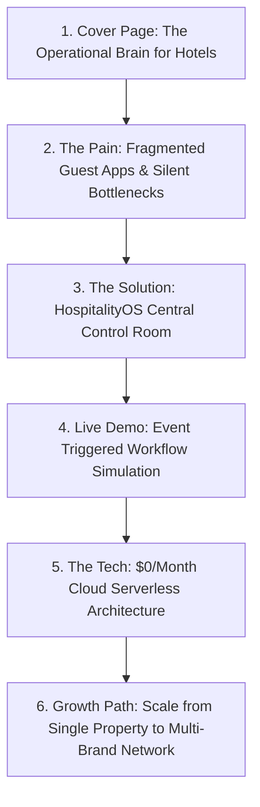

# 🚀 HospitalityOS: The Operational Brain for Modern Lodging
### Pitch Deck & Product Goals Document

HospitalityOS is an **AI-powered operational intelligence layer** that functions as the real-time coordinator of daily hotel execution. Rather than replacing existing transaction-focused software (Property Management Systems (PMS), Point of Sale (POS), or accounting software), HospitalityOS sits above them—integrating silos, automating workflows, and providing predictive intelligence to maximize efficiency and guest satisfaction.

---

## 💡 Executive Summary & The Elevator Pitch

> [!IMPORTANT]
> **The Vision:** Modern properties are drowning in operational data (booking alerts, guest messages, asset telemetry, inventory logs) but lack a unified, intelligent layer to make sense of it. HospitalityOS is that layer—a serverless, zero-maintenance operational brain that translates every event into automated execution, preventing service delays, equipment breakdown, and revenue loss.

```
       [ Siloed Software ]       │       [ HospitalityOS ]
  PMS ──┐                        │
  POS ──┼─► [ Manual Review ]    │  PMS/POS/IoT ──┐
  IoT ──┘                        │  WhatsApp ─────┼─► [ AI Event Brain ] ─► Auto-Routed Tasks
  SMS ──► [ Staff Text Thread ]  │  SMS/Sensors ──┘         │
                                 │                          ▼
                                 │                Real-Time KPI & SLA Control
```

---

## ❌ The Problem: Operational Fragmentation
1. **Siloed Legacy Systems:** PMS and POS tools track reservations and bills but don't manage real-time staff behaviors or cross-department handoffs.
2. **Communication Drops:** Guest requests arrive via WhatsApp, SMS, or in-person, only to get lost in unlogged text groups or verbal instructions.
3. **Reactive Maintenance:** Maintenance only occurs after something breaks, leading to guest complaints, refunds, and expensive emergency repair fees.
4. **Heavy IT Overhead:** Traditional enterprise hotel systems require expensive local servers, complex networking, and dedicated maintenance staff.

---

## ✅ The Solution: HospitalityOS Operational Intelligence Network
HospitalityOS connects the dots by receiving external events, extracting actionable requirements via AI, and routing tasks to the right department automatically. 

### 🌟 Key Product Pillars & Goals
* **Event-Driven Task Orchestration:** Automatically convert booking check-ins, guest WhatsApp requests, and low-inventory warnings into specific team checklists.
* **SLA Safeguard & Escalation:** Define strict completion deadlines (e.g., VIP check-in room prep). If a task breaches its deadline, the system automatically escalates it to managers.
* **Predictive Asset Management:** Process sensor telemetry data from critical equipment (HVAC, Generators) to schedule maintenance *before* a failure occurs.
* **Automated Procurement Loops:** Dynamically order replacement inventory and track deliveries with built-in supervisor verification gates.
* **Yield Optimization:** Track real-time occupancy and market data, using AI to override rates and adjust staff allocation dynamically.

---

## 🏆 Competitive Advantage & The Moat
* **Decoupled Architecture:** The core workflow engine is built on a generic Event $\rightarrow$ Workflow $\rightarrow$ Task design. While designed for hotels, it easily adapts to student housing, hospitals, or co-working spaces.
* **Operational Knowledge Graph:** As the system runs, it builds a graph linking Guests, Rooms, Staff, Assets, and Inventory. AI uses this history to continually recommend smarter workflows.
* **Serverless Cost Efficiency:** Built on Next.js 15, Supabase, and Inngest, the entire platform runs serverless. Infrastructure costs remain near **$0/month** until the property scales, enabling a high-margin SaaS model.

---

## 🗺️ Product Roadmap & Completed Milestones

HospitalityOS is built around three distinct phases, all of which are **fully operational** and ready to pitch.

| Phase | Milestone | Features Built & Operational | Business Value |
| :--- | :--- | :--- | :--- |
| **V1** | **Daily Operations Hub** | - Auto-generate daily SOP checklists<br>- Live task tracking dashboard<br>- Department-based task filters<br>- Resilient offline simulation | Establishes the foundational workflow engine and operational base. |
| **V2** | **Operational Expansion** | - **SLA Approval Gates:** Holds tasks in `PENDING_APPROVAL` status for supervisors<br>- **Vendor & Procurement:** Low-stock triggers & auto-generated purchase workflows<br>- **Multichannel Dispatch:** Live WhatsApp, SMS, and Email integrations | Ensures staff accountability and automates vendor relationships. |
| **V3** | **Operational Intelligence** | - **Revenue Optimizer:** Dynamic occupancy, ADR, RevPAR metrics & AI price overrides<br>- **Predictive Maintenance:** IoT telemetry warning triggers & automated tech dispatch<br>- **Performance Metrics:** Resolution speed & SLA compliance analytics | Maximizes property yield, minimizes downtime, and reveals bottlenecks. |

---

## 🛠️ The Tech Stack (Premium, Serverless, Ready-to-Scale)
* **Frontend/Backend:** [Next.js 15](https://nextjs.org/) App Router (React, Tailwind CSS v4).
* **Database & ORM:** [Supabase PostgreSQL](https://supabase.com/) & [Prisma ORM](https://www.prisma.io/) (configured with an IPv4 connection pooler to bypass local routing limits).
* **Workflows & Queues:** [Inngest](https://www.inngest.com/) for zero-infrastructure background jobs, SLA tracking, and asynchronous tasks.
* **AI Processing:** [Vercel AI SDK](https://sdk.ai.bytpl.dev/) backed by Google Gemini for parsing unstructured text and optimizing logistics.
* **UI/UX Rebrand:** Premium *Nebula Obsidian Glassmorphism* theme, featuring dark modes, interactive percentage progress widgets, neon badges, and Lucide SVG icons.

---

## 📊 Sample Pitch Presentation Structure

When presenting HospitalityOS to investors or property owners, structure your presentation as follows:



1. **Title Slide:** *HospitalityOS: Running properties with AI-driven precision.*
2. **The Problem:** Show how miscommunicated guest requests and unlogged maintenance cost a hotel an average of $2,500/room annually in refunds and repairs.
3. **The Solution:** Demonstrate the *Control Room Dashboard*—where guest SMS, booking changes, and IoT HVAC alerts merge into structured, tracked workflows.
4. **Operational Intelligence:** Detail how predictive maintenance and AI price adjustments add immediate profit (e.g., boosting ADR and preventing emergency chiller failures).
5. **Business Model:** Highlight the low cost of ownership (Vercel/Supabase Serverless) and the high margins of the SaaS model.
